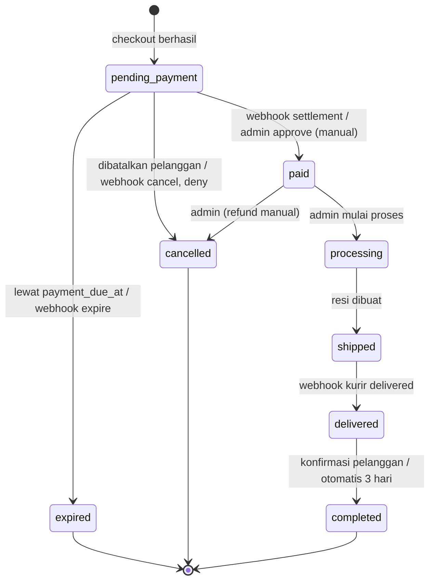
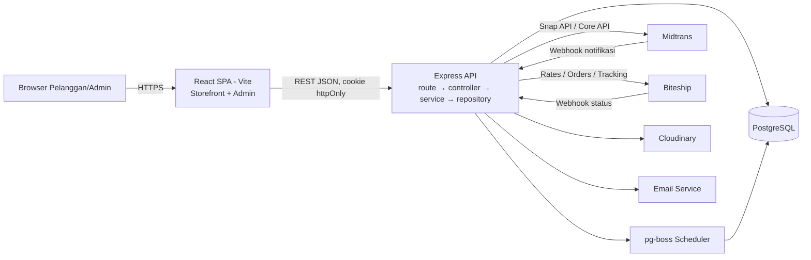
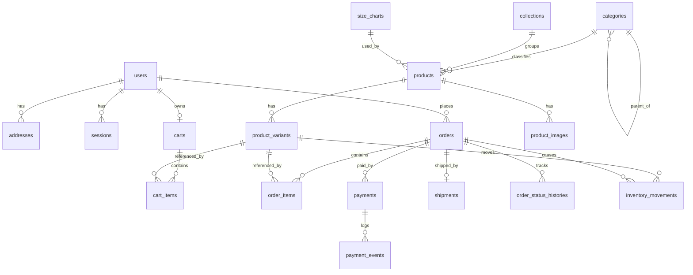

# Product Requirements Document (PRD) — NADA
**E-Commerce & Katalog Busana Muslimah**

| Atribut | Keterangan |
| :---- | :---- |
| Nama Produk | NADA |
| Jenis Dokumen | Product Requirements Document (PRD) |
| Versi | 1.1 (revisi atas v1.0, 8 September 2026) |
| Tanggal Revisi | 30 September 2026 |
| Disusun untuk | Capstone Project |
| Status | Draft untuk Review Pembimbing |

## 0. Catatan Revisi (v1.0 → v1.1)

| # | Bagian | Perubahan | Alasan |
| :-: | ----- | ----- | ----- |
| 1 | §5, §6.3 | Payment gateway dipindah dari *out of scope* ke *in scope* (mode sandbox); transfer manual menjadi *fallback* | CHK-03 (Must) mensyaratkan QRIS/e-wallet, yang tidak dapat diverifikasi otomatis tanpa gateway; v1.0 kontradiktif |
| 2 | §7 (baru) | Penambahan pemodelan proses bisnis *to-be* (BP-01–BP-06) dan *state machine* pesanan | v1.0 belum mendefinisikan alur lintas aktor, status pesanan, dan aturan transisi |
| 3 | §9.3 | Skema database direvisi: snapshot alamat pada `orders`, tabel `shipments`, `payment_events`, `order_status_histories`, `inventory_movements`, `pages`; tipe uang `BIGINT`; atribut dimensi/berat produk | Integritas histori, idempotensi webhook, audit stok, kebutuhan kalkulasi ongkir |
| 4 | §9.1 | Frontend ditetapkan React SPA berbasis Vite + React Router; mitigasi SEO via meta dinamis sisi klien + sitemap.xml dari API | Keputusan tim; SPA lebih sederhana dan memisahkan frontend–backend secara tegas sesuai tujuan akademik |
| 5 | §9.2 | Token autentikasi tidak disimpan di `localStorage` | Rentan dicuri via XSS; bertentangan dengan NFR Security |
| 6 | §9.5 (baru) | Penambahan *shipping/order gateway* (Biteship) untuk ongkir, *booking* kurir, dan pelacakan | CHK-02 (Must) memerlukan estimasi ongkir; v1.0 belum menetapkan sumber data |
| 7 | §12 | Seluruh pertanyaan terbuka v1.0 diberi keputusan yang direkomendasikan | Menghilangkan ambiguitas sebelum development |
| 8 | §6, §6.6 | Penambahan user story: pembatalan otomatis, verifikasi pembayaran manual, input resi, penyesuaian stok, email transaksional | Melengkapi siklus hidup pesanan end-to-end |
| 9 | Format | Perbaikan heading kosong, heading di dalam bullet, diagram arsitektur & sitemap yang rusak (diubah ke Mermaid/code block) | Keterbacaan dokumen |

## 1. Ringkasan Eksekutif

NADA adalah platform e-commerce sekaligus katalog digital busana muslimah (*modest wear*) yang mengintegrasikan fungsi transaksional dengan *brand storytelling*. Setiap koleksi dipresentasikan beserta nilai, filosofi, dan latar belakangnya, mengacu pada pola TAZA (tazalabel.com) dan Saysara (hellosaysara.com): katalog premium yang disertai narasi merek (*brand journal*, *our values*, *lookbook* per koleksi).

Tahap MVP berfokus pada empat pilar:

1. Katalog produk yang dapat difilter dan dicari.
2. Keranjang dan checkout end-to-end dengan pembayaran daring (payment gateway, sandbox) dan kalkulasi ongkir otomatis.
3. Halaman About Us / Our Story.
4. Halaman Collection Story ("A Closer Look At") yang terhubung langsung ke produk koleksi ("Shop the Story").

## 2. Latar Belakang

Industri busana muslimah Indonesia terus bertumbuh, tetapi banyak pelaku UKM *modest fashion* masih bergantung pada marketplace umum (Shopee/Tokopedia) atau media sosial tanpa *branded experience* mandiri. Konsumen Gen Z dan milenial muslimah tidak hanya membeli produk, tetapi mencari *value alignment*, cerita di balik merek, serta pengalaman belanja yang personal dan estetik. NADA menjembatani kebutuhan tersebut: calon pembeli memahami *mengapa* sebuah koleksi dibuat, bukan sekadar *apa* yang dijual.

### 2.1 Studi Referensi

| Referensi | Pola yang Diadopsi |
| ----- | ----- |
| TAZA (tazalabel.com) | Navigasi berbasis koleksi (*lookbook* per musim), "TAZA World" (About Us, Our Values, Commitment), "A Closer Look At" (storytelling koleksi), "Reading Corner" (jurnal), varian warna produk, banner *free shipping*, *newsletter capture* |
| Saysara (hellosaysara.com) | Nada komunikasi hangat-personal, pesan bernuansa spiritual yang menyentuh perjalanan hijrah pelanggan, visual bersih-minimalis |

## 3. Tujuan Produk

### 3.1 Tujuan Bisnis
1. Menyediakan kanal penjualan daring mandiri (non-marketplace) bagi brand NADA.
2. Membangun identitas dan kepercayaan merek melalui storytelling produk.
3. Memfasilitasi transaksi end-to-end (*browse → cart → checkout → payment → fulfillment*) secara terotomasi.

### 3.2 Tujuan Capstone (Akademik)
1. Mendemonstrasikan pengembangan aplikasi full-stack (React + Vite, Node.js/Express, PostgreSQL) pada studi kasus nyata.
2. Menerapkan praktik perancangan sistem: pemodelan proses bisnis, arsitektur berlapis, skema relasional ternormalisasi, REST API, autentikasi, integrasi pihak ketiga berbasis *webhook*, serta manajemen *state* transaksi (cart, order, inventory) yang konsisten.

### 3.3 Tujuan Pengguna
1. Menjelajahi katalog berdasarkan kategori, ukuran, warna, harga, dan koleksi.
2. Memahami cerita/filosofi merek dan koleksi sebelum membeli.
3. Menyelesaikan belanja secara cepat dan aman dengan metode pembayaran yang lazim (QRIS, *virtual account*, e-wallet).

## 4. Target Pengguna & Persona

### 4.1 Target Audiens
Muslimah usia 18–40 tahun di Indonesia yang mencari busana *modest*, syar'i, dan modern; terbiasa belanja daring; aktif di Instagram/TikTok; mementingkan kualitas bahan serta nilai di balik merek.

### 4.2 Persona

**Persona 1 — Aisyah, 24 tahun, karyawan swasta.** Baru konsisten berhijab; mencari abaya/gamis nyaman untuk kerja. Mengandalkan foto produk yang jelas dan panduan ukuran. Menginginkan checkout cepat dengan QRIS/VA/e-wallet.

**Persona 2 — Nadia, 30 tahun, ibu rumah tangga & content creator.** Mencari merek bernilai (etis, syar'i, relevan dengan perjalanan hijrahnya). Membaca jurnal merek sebelum membeli; loyal pada merek yang terasa personal.

**Persona 3 — Admin/Owner NADA (pengguna internal).** Mengelola produk, stok, harga, konten koleksi, dan pesanan. Membutuhkan visibilitas status pembayaran dan pengiriman secara *real-time*.

## 5. Ruang Lingkup

### 5.1 Fitur MVP (In Scope)

| # | Fitur | Deskripsi |
| :-: | ----- | ----- |
| 1 | Katalog Produk | Listing, detail, filter, pencarian, kategori, koleksi |
| 2 | Keranjang | Tambah/ubah/hapus item per varian, subtotal, validasi stok |
| 3 | Checkout | Alamat, ongkir otomatis, ringkasan, pembuatan pesanan |
| 4 | Pembayaran | Payment gateway (Midtrans Snap, mode sandbox) + fallback transfer manual |
| 5 | Pengiriman | Kalkulasi ongkir multi-kurir & pelacakan resi (Biteship, mode test) |
| 6 | About Us / Our Story | Halaman cerita merek, dikelola via admin |
| 7 | Collection Story | Narasi per koleksi + "Shop the Story" |
| 8 | Autentikasi | Register, login, logout, sesi aman |
| 9 | Akun & Riwayat Pesanan | Alamat tersimpan, riwayat & status pesanan |
| 10 | Admin Panel | CRUD produk/varian/koleksi, stok, pesanan, verifikasi pembayaran manual, input resi |
| 11 | Notifikasi Email | Email transaksional (pesanan dibuat, dibayar, dikirim) |

*Catatan: fitur #4, #5, #8–#11 merupakan prasyarat teknis agar fitur inti (cart & checkout) berfungsi utuh dan dapat diuji sebagai sistem e-commerce lengkap, meskipun tidak tercantum eksplisit dalam brief awal.*

### 5.2 Out of Scope (Future Roadmap)
1. Live chat / chatbot layanan pelanggan.
2. Review & rating produk.
3. Wishlist & notifikasi *restock*.
4. Program loyalitas/poin.
5. Multi-currency & pengiriman internasional.
6. Guest checkout (keranjang tamu tetap didukung; checkout mewajibkan login).
7. Voucher/kode promo.
8. Retur, penukaran ukuran, dan *refund* terotomasi (MVP: ditangani manual oleh admin di luar sistem; kebijakan dicantumkan di halaman FAQ).
9. Rekomendasi produk berbasis AI.
10. Aplikasi mobile native.
11. Mode multi-vendor/marketplace.
12. Blog/jurnal dengan CMS penuh (MVP: story koleksi & About Us via editor sederhana di admin panel).
13. Pembayaran di lingkungan produksi (memerlukan verifikasi badan usaha/KYC oleh penyedia gateway).

## 6. User Stories & Functional Requirements

### 6.1 Modul Katalog Produk

| ID | User Story | Prioritas |
| ----- | ----- | :-: |
| KAT-01 | Sebagai pengunjung, saya ingin melihat daftar semua produk agar dapat menjelajah katalog. | Must |
| KAT-02 | Sebagai pengunjung, saya ingin memfilter produk berdasarkan kategori (gamis, abaya, khimar, set, dll.), ukuran, warna, rentang harga, dan koleksi. | Must |
| KAT-03 | Sebagai pengunjung, saya ingin mencari produk berdasarkan nama/keyword. | Must |
| KAT-04 | Sebagai pengunjung, saya ingin melihat detail produk (foto multi-angle per warna, deskripsi, bahan, perawatan, size chart, varian, harga, ketersediaan). | Must |
| KAT-05 | Sebagai pengunjung, saya ingin melihat produk dikelompokkan per koleksi/launching (*lookbook*). | Should |
| KAT-06 | Sebagai pengunjung, saya ingin melihat badge status produk (New Arrival, Best Seller, Sold Out). | Could |

**Functional Requirements:**
- FR-KAT-1: Produk ditampilkan dalam grid dengan pagination berbasis *cursor* atau *offset* (maks. 24 item/halaman).
- FR-KAT-2: Setiap produk memiliki tepat 1 kategori, 0..1 koleksi, dan ≥1 varian (ukuran × warna) dengan stok masing-masing.
- FR-KAT-3: Pencarian menggunakan PostgreSQL *full-text search* + `pg_trgm` (toleran salah ketik) atas nama dan deskripsi.
- FR-KAT-4: Galeri gambar berganti sesuai warna yang dipilih; status ketersediaan ditampilkan per varian.
- FR-KAT-5: Status *Sold Out* diturunkan (*derived*) dari total stok varian aktif = 0, bukan disimpan manual.
- FR-KAT-6: Hanya produk berstatus `active` yang tampil di storefront.

### 6.2 Modul Keranjang (Cart)

| ID | User Story | Prioritas |
| :-: | ----- | :-: |
| CRT-01 | Sebagai pengguna, saya ingin menambahkan produk dengan varian tertentu ke keranjang. | Must |
| CRT-02 | Sebagai pengguna, saya ingin mengubah jumlah atau menghapus item. | Must |
| CRT-03 | Sebagai pengguna, saya ingin melihat subtotal di keranjang (ongkir final dihitung di checkout setelah alamat dipilih). | Must |
| CRT-04 | Sebagai pengguna login, saya ingin keranjang tersimpan lintas perangkat/sesi. | Should |
| CRT-05 | Sebagai tamu, saya ingin tetap dapat menambahkan item ke keranjang sebelum diminta login saat checkout. | Should |

**Functional Requirements:**
- FR-CRT-1: Stok divalidasi setiap kali item ditambah/diubah (*soft check*); validasi final (*hard check*) terjadi di transaksi checkout.
- FR-CRT-2: Keranjang pengguna login disimpan di database (*server-authoritative*); keranjang tamu disimpan di `localStorage`, lalu digabung (`POST /api/cart/merge`) saat login. Aturan merge: kuantitas dijumlahkan, dibatasi stok tersedia.
- FR-CRT-3: Harga di keranjang selalu dibaca ulang dari server; harga dari klien tidak pernah dipercaya.
- FR-CRT-4: Sistem menampilkan notifikasi bila stok varian tidak mencukupi atau varian dinonaktifkan.

### 6.3 Modul Checkout & Pembayaran

| ID | User Story | Prioritas |
| :-: | ----- | :-: |
| CHK-01 | Sebagai pengguna, saya ingin memilih/menambah alamat pengiriman saat checkout. | Must |
| CHK-02 | Sebagai pengguna, saya ingin memilih kurir & layanan serta melihat ongkos kirim dan estimasi tiba. | Must |
| CHK-03 | Sebagai pengguna, saya ingin membayar via QRIS, *virtual account*, atau e-wallet. | Must |
| CHK-04 | Sebagai pengguna, saya ingin melihat ringkasan pesanan sebelum konfirmasi. | Must |
| CHK-05 | Sebagai pengguna, saya ingin menerima konfirmasi di layar dan email setelah pesanan dibuat dan setelah pembayaran berhasil. | Must |
| CHK-06 | Sebagai pengguna, saya ingin melacak status pesanan dan resi pengiriman. | Should |
| CHK-07 | Sebagai pengguna, saya ingin melanjutkan pembayaran yang tertunda dari halaman riwayat pesanan sebelum batas waktu. | Should |
| CHK-08 | Sebagai pengguna, saya ingin membatalkan pesanan yang belum dibayar. | Should |

**Functional Requirements:**
- FR-CHK-1: Checkout mewajibkan login.
- FR-CHK-2: Pembuatan pesanan, pengurangan stok, pencatatan `inventory_movements`, dan pembuatan `payments` berstatus `pending` dijalankan dalam **satu transaksi basis data** (lihat §9.3.4).
- FR-CHK-3: Pesanan menyimpan *snapshot* harga, nama produk, label varian, dan alamat pengiriman sehingga histori tidak berubah bila data master berubah.
- FR-CHK-4: Stok dikurangi saat pesanan dibuat (*reserve-on-order*); pesanan yang tidak dibayar hingga `payment_due_at` (default 24 jam) diubah menjadi `expired` dan stoknya dikembalikan.
- FR-CHK-5: Ongkos kirim dihitung ulang di server saat checkout (bukan diterima dari klien), berdasarkan berat total dan tujuan.
- FR-CHK-6: Status pembayaran hanya diubah oleh *webhook* gateway yang tanda tangannya valid (atau oleh admin untuk metode manual), bukan oleh *redirect* di sisi klien.
- FR-CHK-7: Pemrosesan webhook bersifat *idempotent*: notifikasi ganda tidak menghasilkan perubahan status ganda.

### 6.4 Modul About Us / Our Story

| ID | User Story | Prioritas |
| :-: | ----- | :-: |
| ABT-01 | Sebagai pengunjung, saya ingin membaca cerita berdirinya NADA, visi, misi, dan nilai merek. | Must |
| ABT-02 | Sebagai pengunjung, saya ingin melihat foto/video yang memperkuat identitas merek. | Should |
| ABT-03 | Sebagai pengunjung, saya ingin melihat kontak & tautan media sosial. | Should |

- FR-ABT-1: Konten disimpan pada entitas `pages` (format blok JSON dari editor *rich text*) dan dapat diubah admin tanpa *deploy* ulang.

### 6.5 Modul Collection Story

| ID | User Story | Prioritas |
| :-: | ----- | :-: |
| STR-01 | Sebagai pengunjung, saya ingin membaca inspirasi di balik setiap koleksi (tema, bahan, proses desain). | Must |
| STR-02 | Sebagai pengunjung, saya ingin langsung membeli produk dari halaman cerita ("Shop the Story"). | Should |
| STR-03 | Sebagai admin, saya ingin menambah/mengedit cerita koleksi saat peluncuran produk baru. | Must |

- FR-STR-1: Entitas `collections` memuat judul cerita, narasi (blok JSON), *cover*, tanggal peluncuran, status publikasi, dan metadata SEO; relasi 1:N ke `products`.
- FR-STR-2: Homepage menampilkan "A Closer Look At [Koleksi Terbaru]" dari koleksi `published` dengan `launch_date` terbaru.

### 6.6 Modul Pendukung

| ID | User Story | Prioritas |
| ----- | ----- | :-: |
| AUTH-01 | Sebagai pengguna baru, saya ingin mendaftar dengan email & password. | Must |
| AUTH-02 | Sebagai pengguna, saya ingin login & logout dengan aman. | Must |
| AUTH-03 | Sebagai pengguna, saya ingin mengatur ulang password via email. | Should |
| ACC-01 | Sebagai pengguna, saya ingin melihat riwayat & detail pesanan. | Must |
| ACC-02 | Sebagai pengguna, saya ingin mengelola alamat tersimpan. | Must |
| ADM-01 | Sebagai admin, saya ingin mengelola produk beserta varian dan gambarnya. | Must |
| ADM-02 | Sebagai admin, saya ingin melihat dan memfilter pesanan berdasarkan status. | Must |
| ADM-03 | Sebagai admin, saya ingin mengelola konten koleksi dan halaman About Us. | Should |
| ADM-04 | Sebagai admin, saya ingin memverifikasi/menolak bukti transfer manual. | Must |
| ADM-05 | Sebagai admin, saya ingin memproses pesanan dan memasukkan nomor resi (atau *booking* kurir via API). | Must |
| ADM-06 | Sebagai admin, saya ingin menyesuaikan stok (restock/koreksi) dengan jejak audit. | Should |
| ADM-07 | Sebagai admin, saya ingin melihat ringkasan penjualan harian/bulanan. | Could |

## 7. Proses Bisnis (To-Be)

### 7.1 Aktor & Sistem Eksternal

| Aktor | Peran |
| ----- | ----- |
| Pelanggan | Menjelajah, memesan, membayar, menerima barang |
| Sistem NADA | Storefront, API, basis data, *scheduler* |
| Admin NADA | Mengelola katalog, konten, memverifikasi, memproses & mengirim pesanan |
| Payment Gateway (Midtrans) | Memproses pembayaran, mengirim notifikasi (*webhook*) |
| Shipping Aggregator (Biteship) | Menyediakan tarif, *booking* kurir, status pelacakan (*webhook*) |
| Kurir | Pickup & pengantaran |

### 7.2 Daftar Proses Bisnis

| Kode | Proses | Pemicu | Luaran |
| ----- | ----- | ----- | ----- |
| BP-01 | Pemesanan (browse → checkout) | Pelanggan menekan "Buat Pesanan" | Pesanan `pending_payment`, stok ter-*reserve* |
| BP-02 | Pembayaran via gateway | Pesanan dibuat | Pesanan `paid` atau `expired`/`cancelled` |
| BP-03 | Pembayaran manual (fallback) | Pelanggan memilih transfer manual | Bukti diverifikasi admin → `paid` |
| BP-04 | Pemenuhan & pengiriman | Pesanan `paid` | Pesanan `shipped` → `delivered` → `completed` |
| BP-05 | Pembatalan & kedaluwarsa | Pelanggan batal / lewat `payment_due_at` | Pesanan `cancelled`/`expired`, stok dikembalikan |
| BP-06 | Peluncuran koleksi | Admin menyiapkan koleksi baru | Koleksi & produk `published`, tampil di homepage |

### 7.3 BP-01 & BP-02 — Pemesanan dan Pembayaran

1. Pelanggan menambahkan varian ke keranjang → sistem memeriksa stok (*soft check*).
2. Pelanggan menuju checkout → sistem memaksa login dan menggabungkan keranjang tamu.
3. Pelanggan memilih alamat → sistem meminta tarif ke Biteship berdasarkan `area_id`/kode pos tujuan dan total berat → menampilkan opsi kurir.
4. Pelanggan memilih kurir dan menekan "Buat Pesanan" → sistem menjalankan transaksi atomik (validasi stok, kurangi stok, buat `orders`, `order_items`, `inventory_movements`, `payments`).
5. Sistem meminta Snap token ke Midtrans (di luar transaksi DB) → mengembalikan token ke klien → *popup* Snap tampil.
6. Pelanggan membayar di kanal pilihan (QRIS/VA/e-wallet).
7. Midtrans mengirim *HTTP notification* ke `POST /api/webhooks/midtrans` → sistem memverifikasi `signature_key`, mencatat ke `payment_events` (idempoten), memetakan status, memperbarui `payments` & `orders`, mencatat `order_status_histories`, dan mengirim email "Pembayaran Diterima".
8. Klien diarahkan ke halaman status pesanan yang membaca status dari server (*polling* ringan), bukan dari hasil *redirect*.

```mermaid
sequenceDiagram
    autonumber
    actor P as Pelanggan
    participant FE as Storefront (React SPA)
    participant API as NADA API
    participant DB as PostgreSQL
    participant BS as Biteship
    participant MT as Midtrans
    P->>FE: Pilih alamat
    FE->>API: POST /shipping/rates
    API->>BS: POST /v1/rates/couriers
    BS-->>API: Daftar tarif
    API-->>FE: Opsi kurir
    P->>FE: Buat Pesanan
    FE->>API: POST /checkout {address_id, courier}
    API->>BS: Hitung ulang ongkir (server-side)
    API->>DB: BEGIN; kurangi stok; insert order/items/payment; COMMIT
    API->>MT: Create Snap transaction
    MT-->>API: snap_token
    API-->>FE: order_number + snap_token
    FE->>MT: snap.pay(token)
    P->>MT: Bayar (QRIS/VA/e-wallet)
    MT->>API: POST /webhooks/midtrans
    API->>API: Verifikasi signature + idempotensi
    API->>DB: payment=paid, order=paid, history
    API-->>MT: 200 OK
    FE->>API: GET /orders/:number (polling)
    API-->>FE: status = paid
```

### 7.4 BP-03 — Pembayaran Manual (Fallback)
Pelanggan memilih "Transfer Manual" → sistem menampilkan rekening/QRIS statis dan nominal unik → pelanggan mengunggah bukti → `payments.status = awaiting_verification` → admin memverifikasi di panel: *approve* → `paid`; *reject* → pelanggan dapat mengunggah ulang sebelum `payment_due_at`. Metode ini diaktifkan via *feature flag* agar demo tetap dapat berjalan bila sandbox gateway bermasalah.

### 7.5 BP-04 — Pemenuhan & Pengiriman
1. Admin melihat antrean pesanan `paid` → mengubah ke `processing` (mulai dikemas).
2. Admin memilih salah satu: (a) *booking* kurir via Biteship Orders API (resi & jadwal pickup otomatis), atau (b) memasukkan nomor resi manual.
3. Sistem membuat `shipments`, mengubah pesanan ke `shipped`, mengirim email berisi resi & tautan pelacakan.
4. Webhook Biteship (atau pengecekan terjadwal) memperbarui status pengiriman; status `delivered` mengubah pesanan ke `delivered`.
5. Pesanan menjadi `completed` saat pelanggan menekan "Pesanan Diterima" atau otomatis 3 hari setelah `delivered`.

### 7.6 BP-05 — Pembatalan & Kedaluwarsa
- *Scheduler* berjalan tiap 5 menit: pesanan `pending_payment` dengan `payment_due_at < now()` → `expired`, stok dikembalikan (`inventory_movements.reason = 'release'`).
- Webhook Midtrans `expire`/`cancel`/`deny` memicu transisi yang sama.
- Pelanggan dapat membatalkan pesanan `pending_payment`; sistem sekaligus membatalkan transaksi di Midtrans (Cancel API).
- Pembatalan setelah `paid` hanya oleh admin; *refund* dilakukan manual di luar sistem (MVP), dicatat pada `order_status_histories.note`.

### 7.7 BP-06 — Peluncuran Koleksi
Admin membuat koleksi (`draft`) → menulis cerita & mengunggah *cover* → menautkan produk → mengatur `launch_date` → *publish*. Konten dibaca dari API saat runtime sehingga halaman koleksi dan homepage langsung diperbarui tanpa *deploy* ulang.

### 7.8 State Machine Pesanan



| Transisi | Aktor | Efek Samping |
| ----- | ----- | ----- |
| → `pending_payment` | Sistem | Stok berkurang, email "Menunggu Pembayaran" |
| → `paid` | Webhook / Admin | `paid_at` terisi, email "Pembayaran Diterima" |
| → `expired` / `cancelled` (dari `pending_payment`) | Scheduler / Webhook / Pelanggan | Stok dikembalikan |
| → `cancelled` (dari `paid`) | Admin | Stok dikembalikan, catatan refund manual |
| → `shipped` | Admin / Sistem | `shipments` dibuat, email resi |
| → `delivered` / `completed` | Webhook / Pelanggan / Scheduler | — |

Setiap transisi divalidasi terhadap tabel ini di *service layer*; transisi di luar tabel ditolak (HTTP 409).

## 8. Non-Functional Requirements

| Kategori | Requirement |
| :-: | ----- |
| Usability | Responsif *mobile-first*; alur checkout ≤ 3 langkah layar. |
| Performance | Katalog & detail produk dimuat < 3 detik (4G); gambar dioptimasi (WebP/AVIF, *lazy-load*); *code splitting* per route (`React.lazy`); respons katalog di-*cache* (header `Cache-Control` + `staleTime` TanStack Query). |
| Security | Password di-hash (argon2id/bcrypt); sesi via cookie `httpOnly`, `Secure`, `SameSite=Lax`; validasi skema input (Zod) di semua endpoint; *query* terparameterisasi (ORM); *rate limiting* pada auth & checkout; verifikasi signature webhook; *secret* hanya di variabel lingkungan server. |
| Reliability | Checkout & mutasi stok atomik (transaksi PostgreSQL + `UPDATE … WHERE stock >= qty`); webhook idempoten; *scheduler* rekonsiliasi pesanan kedaluwarsa. |
| Consistency | Harga, ongkir, dan total dihitung ulang di server; klien hanya mengirim ID & kuantitas. |
| Scalability | Penambahan produk/kategori/koleksi tanpa perubahan skema; penyedia pembayaran/pengiriman diabstraksikan melalui *interface* (`PaymentProvider`, `ShippingProvider`). |
| Maintainability | Backend berlapis (route → controller → service → repository); TypeScript di seluruh *codebase*; skema validasi dibagi antara frontend dan backend. |
| SEO | Meta title/description, Open Graph, dan *structured data* (`Product`) dinamis per produk/koleksi; sitemap.xml otomatis. |
| Accessibility | Kontras WCAG AA, *alt text* gambar produk, navigasi keyboard, label form eksplisit. |
| Observability | Log terstruktur (pino) dengan `request_id`; pencatatan seluruh payload webhook pada `payment_events`. |

## 9. Spesifikasi Teknis

### 9.1 Rekomendasi Tech Stack

| Layer | Rekomendasi | Justifikasi |
| ----- | ----- | ----- |
| Frontend (storefront + admin) | **React + Vite + TypeScript, React Router** | SPA ringan dengan *build* cepat; pemisahan tegas frontend–backend; admin panel pada route `/admin` yang terproteksi dan di-*lazy load* |
| SEO (mitigasi SPA) | Tag `<title>`/`<meta>` dinamis per halaman (React 19 metadata atau `react-helmet-async`); `GET /sitemap.xml` dari API | Crawler modern (Googlebot) merender JavaScript; preview media sosial (Open Graph) tetap terbatas — dicatat sebagai *trade-off* |
| Styling & UI | Tailwind CSS + shadcn/ui | Komponen aksesibel, mudah dikustomisasi untuk estetika minimalis ala referensi |
| Server state | TanStack Query | *Caching*, *refetch*, *optimistic update* untuk cart |
| Client state | Zustand (+ `persist` untuk keranjang tamu) | Ringan dibanding Redux untuk cakupan MVP |
| Form & validasi | React Hook Form + Zod | Skema Zod dapat dipakai ulang di backend |
| Editor konten | Tiptap | Menulis story koleksi & About Us; output JSON disimpan di `jsonb` |
| Backend | **Node.js + Express + TypeScript** (alternatif: NestJS bila tim menginginkan struktur modul yang dipaksakan) | Memenuhi tujuan akademik arsitektur berlapis yang eksplisit |
| ORM & migrasi | Prisma | Skema deklaratif, migrasi terversi, *type-safe*; `$transaction` untuk checkout; *raw query* untuk FTS |
| Database | PostgreSQL 16+ (ekstensi `pg_trgm`, `citext`) | Relasional, transaksi ACID, FTS bawaan |
| Autentikasi | Sesi *server-side* (tabel `sessions`) via cookie `httpOnly`; atau JWT *access* (15 menit) + *refresh token* berotasi (disimpan ter-hash) dalam cookie `httpOnly` | Menghindari penyimpanan token di `localStorage` |
| Job terjadwal | pg-boss (antrean berbasis PostgreSQL) atau node-cron | Kedaluwarsa pesanan & auto-complete tanpa tambahan Redis |
| Email | Resend atau Nodemailer + SMTP (mis. Brevo) | Email transaksional CHK-05 |
| Penyimpanan gambar | Cloudinary (*signed upload* dari admin) | Transformasi & optimasi gambar otomatis |
| Pembayaran | Midtrans Snap (sandbox) | Lihat §9.4 |
| Pengiriman | Biteship API (test key) | Lihat §9.5 |
| Pengujian | Vitest (unit), Supertest (API), Playwright (E2E checkout) | Bukti uji user story "Must" |
| Struktur repo | Monorepo pnpm workspace: `apps/web`, `apps/api`, `packages/shared` (Zod schema, tipe) | Konsistensi kontrak API |
| Hosting | Web: Vercel; API: Render/Railway; DB: Neon/Supabase; tunnel ngrok/Cloudflare Tunnel saat development (webhook memerlukan URL publik) | Gratis/terjangkau untuk demo |

*Catatan deployment:* bila web dan API berada di domain berbeda, cookie lintas situs akan diblokir browser. Gunakan subdomain yang sama (`nada.id` & `api.nada.id`) atau *rewrite* `/api/*` ke server API (proxy Vite saat development; `vercel.json` rewrites saat produksi) agar browser memperlakukan API sebagai *same-origin*.

### 9.2 Arsitektur Sistem



Struktur modul backend (per domain): `auth`, `catalog`, `collections`, `cart`, `checkout`, `orders`, `payments`, `shipping`, `admin`, `content`. Integrasi pihak ketiga diakses hanya melalui *adapter* di lapisan `providers/` agar penyedia dapat diganti (mis. Midtrans → Xendit) tanpa mengubah *service*.

### 9.3 Skema Database (PostgreSQL)

#### 9.3.1 Prinsip Desain
1. Nilai uang disimpan sebagai `BIGINT` dalam rupiah (tanpa desimal) — menghindari galat *floating point*.
2. Data transaksi (pesanan) menyimpan *snapshot*; data master tidak di-*hard delete* bila sudah direferensikan (gunakan `status = archived`/`is_active = false`).
3. Status dimodelkan dengan tipe `ENUM`; perubahan status pesanan dicatat di tabel histori.
4. Setiap mutasi stok tercatat pada *ledger* `inventory_movements` (jejak audit).
5. Integrasi eksternal menyimpan referensi penyedia (`provider_ref`) dan payload mentah untuk rekonsiliasi.

#### 9.3.2 ERD (Ringkas)



#### 9.3.3 DDL

```sql
CREATE EXTENSION IF NOT EXISTS citext;
CREATE EXTENSION IF NOT EXISTS pg_trgm;

CREATE TYPE user_role        AS ENUM ('customer','admin');
CREATE TYPE publish_status   AS ENUM ('draft','published','archived');
CREATE TYPE product_status   AS ENUM ('draft','active','archived');
CREATE TYPE order_status     AS ENUM ('pending_payment','paid','processing','shipped',
                                      'delivered','completed','cancelled','expired');
CREATE TYPE payment_provider AS ENUM ('midtrans','manual');
CREATE TYPE payment_status   AS ENUM ('pending','awaiting_verification','paid',
                                      'expired','cancelled','failed','refunded');
CREATE TYPE shipment_status  AS ENUM ('pending','booked','picked_up','in_transit',
                                      'delivered','returned','cancelled');
CREATE TYPE stock_reason     AS ENUM ('initial','restock','adjustment','checkout','release');

-- ============ IDENTITAS ============
CREATE TABLE users (
  id               UUID PRIMARY KEY DEFAULT gen_random_uuid(),
  name             VARCHAR(120) NOT NULL,
  email            CITEXT UNIQUE NOT NULL,
  password_hash    TEXT NOT NULL,
  phone            VARCHAR(20),
  role             user_role NOT NULL DEFAULT 'customer',
  email_verified_at TIMESTAMPTZ,
  created_at       TIMESTAMPTZ NOT NULL DEFAULT now(),
  updated_at       TIMESTAMPTZ NOT NULL DEFAULT now()
);

CREATE TABLE sessions (                      -- sesi / refresh token (ter-hash)
  id          UUID PRIMARY KEY DEFAULT gen_random_uuid(),
  user_id     UUID NOT NULL REFERENCES users(id) ON DELETE CASCADE,
  token_hash  TEXT UNIQUE NOT NULL,
  user_agent  TEXT,
  expires_at  TIMESTAMPTZ NOT NULL,
  revoked_at  TIMESTAMPTZ,
  created_at  TIMESTAMPTZ NOT NULL DEFAULT now()
);

CREATE TABLE addresses (
  id             UUID PRIMARY KEY DEFAULT gen_random_uuid(),
  user_id        UUID NOT NULL REFERENCES users(id) ON DELETE CASCADE,
  label          VARCHAR(40),                -- "Rumah", "Kantor"
  recipient_name VARCHAR(120) NOT NULL,
  phone          VARCHAR(20)  NOT NULL,
  address_line   TEXT NOT NULL,
  district       VARCHAR(80)  NOT NULL,      -- kecamatan
  city           VARCHAR(80)  NOT NULL,
  province       VARCHAR(80)  NOT NULL,
  postal_code    VARCHAR(10)  NOT NULL,
  area_id        VARCHAR(64),                -- ID area Biteship (Maps API)
  latitude       NUMERIC(9,6),
  longitude      NUMERIC(9,6),
  is_default     BOOLEAN NOT NULL DEFAULT false,
  created_at     TIMESTAMPTZ NOT NULL DEFAULT now()
);
CREATE UNIQUE INDEX uq_address_default ON addresses(user_id) WHERE is_default;

-- ============ KATALOG & KONTEN ============
CREATE TABLE categories (
  id         SERIAL PRIMARY KEY,
  parent_id  INT REFERENCES categories(id),
  name       VARCHAR(80) NOT NULL,
  slug       VARCHAR(100) UNIQUE NOT NULL,
  sort_order INT NOT NULL DEFAULT 0
);

CREATE TABLE collections (
  id              SERIAL PRIMARY KEY,
  name            VARCHAR(120) NOT NULL,
  slug            VARCHAR(140) UNIQUE NOT NULL,
  tagline         VARCHAR(200),
  story_title     VARCHAR(200),
  story_content   JSONB,                     -- output editor Tiptap
  cover_image_url TEXT,
  launch_date     DATE,
  status          publish_status NOT NULL DEFAULT 'draft',
  seo_title       VARCHAR(70),
  seo_description VARCHAR(160),
  published_at    TIMESTAMPTZ,
  created_at      TIMESTAMPTZ NOT NULL DEFAULT now(),
  updated_at      TIMESTAMPTZ NOT NULL DEFAULT now()
);

CREATE TABLE size_charts (
  id           SERIAL PRIMARY KEY,
  name         VARCHAR(80) NOT NULL,         -- "Gamis Regular", "Khimar"
  measurements JSONB NOT NULL                -- {"S":{"lingkar_dada":96,"panjang":135}, ...}
);

CREATE TABLE products (
  id                 UUID PRIMARY KEY DEFAULT gen_random_uuid(),
  category_id        INT NOT NULL REFERENCES categories(id),
  collection_id      INT REFERENCES collections(id) ON DELETE SET NULL,
  size_chart_id      INT REFERENCES size_charts(id),
  name               VARCHAR(160) NOT NULL,
  slug               VARCHAR(180) UNIQUE NOT NULL,
  description        TEXT,
  material           VARCHAR(160),
  care_instructions  TEXT,
  base_price         BIGINT NOT NULL CHECK (base_price >= 0),
  weight_gram        INT NOT NULL CHECK (weight_gram > 0),   -- wajib untuk ongkir
  length_cm INT, width_cm INT, height_cm INT,
  status             product_status NOT NULL DEFAULT 'draft',
  is_featured        BOOLEAN NOT NULL DEFAULT false,
  seo_title          VARCHAR(70),
  seo_description    VARCHAR(160),
  search_vector      TSVECTOR GENERATED ALWAYS AS (
                       to_tsvector('simple', coalesce(name,'') || ' ' || coalesce(description,''))
                     ) STORED,
  created_at         TIMESTAMPTZ NOT NULL DEFAULT now(),
  updated_at         TIMESTAMPTZ NOT NULL DEFAULT now()
);
CREATE INDEX idx_products_category   ON products(category_id);
CREATE INDEX idx_products_collection ON products(collection_id);
CREATE INDEX idx_products_status     ON products(status);
CREATE INDEX idx_products_fts        ON products USING GIN(search_vector);
CREATE INDEX idx_products_name_trgm  ON products USING GIN(name gin_trgm_ops);

CREATE TABLE product_variants (
  id             UUID PRIMARY KEY DEFAULT gen_random_uuid(),
  product_id     UUID NOT NULL REFERENCES products(id) ON DELETE CASCADE,
  sku            VARCHAR(60) UNIQUE NOT NULL,
  color_name     VARCHAR(40) NOT NULL,
  color_hex      CHAR(7),
  size           VARCHAR(20) NOT NULL,       -- S, M, L, XL, All Size
  price_override BIGINT CHECK (price_override >= 0),
  stock          INT NOT NULL DEFAULT 0 CHECK (stock >= 0),
  is_active      BOOLEAN NOT NULL DEFAULT true,
  UNIQUE (product_id, color_name, size)
);

CREATE TABLE product_images (
  id         UUID PRIMARY KEY DEFAULT gen_random_uuid(),
  product_id UUID NOT NULL REFERENCES products(id) ON DELETE CASCADE,
  color_name VARCHAR(40),                    -- NULL = berlaku untuk semua warna
  url        TEXT NOT NULL,
  alt_text   VARCHAR(160),
  sort_order INT NOT NULL DEFAULT 0,
  is_primary BOOLEAN NOT NULL DEFAULT false
);

CREATE TABLE pages (                          -- About Us, FAQ, Kebijakan
  id         SERIAL PRIMARY KEY,
  slug       VARCHAR(80) UNIQUE NOT NULL,
  title      VARCHAR(160) NOT NULL,
  content    JSONB NOT NULL,
  status     publish_status NOT NULL DEFAULT 'draft',
  updated_at TIMESTAMPTZ NOT NULL DEFAULT now()
);

-- ============ KERANJANG ============
CREATE TABLE carts (                          -- hanya pengguna login; tamu di localStorage
  id         UUID PRIMARY KEY DEFAULT gen_random_uuid(),
  user_id    UUID UNIQUE NOT NULL REFERENCES users(id) ON DELETE CASCADE,
  updated_at TIMESTAMPTZ NOT NULL DEFAULT now()
);

CREATE TABLE cart_items (
  id         UUID PRIMARY KEY DEFAULT gen_random_uuid(),
  cart_id    UUID NOT NULL REFERENCES carts(id) ON DELETE CASCADE,
  variant_id UUID NOT NULL REFERENCES product_variants(id) ON DELETE CASCADE,
  quantity   INT NOT NULL CHECK (quantity > 0),
  added_at   TIMESTAMPTZ NOT NULL DEFAULT now(),
  UNIQUE (cart_id, variant_id)
);

-- ============ PESANAN ============
CREATE TABLE orders (
  id               UUID PRIMARY KEY DEFAULT gen_random_uuid(),
  order_number     VARCHAR(30) UNIQUE NOT NULL,   -- NADA-20260930-0001
  user_id          UUID NOT NULL REFERENCES users(id),
  status           order_status NOT NULL DEFAULT 'pending_payment',
  subtotal         BIGINT NOT NULL CHECK (subtotal >= 0),
  shipping_cost    BIGINT NOT NULL CHECK (shipping_cost >= 0),
  discount         BIGINT NOT NULL DEFAULT 0,
  total            BIGINT NOT NULL CHECK (total >= 0),
  total_weight_gram INT NOT NULL,
  -- snapshot alamat (tidak FK ke addresses)
  ship_recipient   VARCHAR(120) NOT NULL,
  ship_phone       VARCHAR(20)  NOT NULL,
  ship_address     TEXT NOT NULL,
  ship_district    VARCHAR(80)  NOT NULL,
  ship_city        VARCHAR(80)  NOT NULL,
  ship_province    VARCHAR(80)  NOT NULL,
  ship_postal_code VARCHAR(10)  NOT NULL,
  ship_area_id     VARCHAR(64),
  courier_code     VARCHAR(30)  NOT NULL,         -- jne, jnt, sicepat
  courier_service  VARCHAR(30)  NOT NULL,         -- reg, yes
  customer_note    TEXT,
  payment_due_at   TIMESTAMPTZ NOT NULL,
  paid_at          TIMESTAMPTZ,
  completed_at     TIMESTAMPTZ,
  cancelled_at     TIMESTAMPTZ,
  cancel_reason    TEXT,
  created_at       TIMESTAMPTZ NOT NULL DEFAULT now(),
  updated_at       TIMESTAMPTZ NOT NULL DEFAULT now(),
  CHECK (total = subtotal + shipping_cost - discount)
);
CREATE INDEX idx_orders_user    ON orders(user_id, created_at DESC);
CREATE INDEX idx_orders_status  ON orders(status);
CREATE INDEX idx_orders_due     ON orders(payment_due_at) WHERE status = 'pending_payment';

CREATE TABLE order_items (
  id            UUID PRIMARY KEY DEFAULT gen_random_uuid(),
  order_id      UUID NOT NULL REFERENCES orders(id) ON DELETE CASCADE,
  variant_id    UUID REFERENCES product_variants(id) ON DELETE SET NULL,
  product_name  VARCHAR(160) NOT NULL,        -- snapshot
  variant_label VARCHAR(80)  NOT NULL,        -- "Dusty Pink / M"
  sku           VARCHAR(60)  NOT NULL,
  image_url     TEXT,
  unit_price    BIGINT NOT NULL,
  quantity      INT NOT NULL CHECK (quantity > 0),
  line_total    BIGINT NOT NULL,
  CHECK (line_total = unit_price * quantity)
);

CREATE TABLE order_status_histories (
  id          BIGSERIAL PRIMARY KEY,
  order_id    UUID NOT NULL REFERENCES orders(id) ON DELETE CASCADE,
  from_status order_status,
  to_status   order_status NOT NULL,
  changed_by  UUID REFERENCES users(id),      -- NULL = sistem/webhook
  note        TEXT,
  created_at  TIMESTAMPTZ NOT NULL DEFAULT now()
);

-- ============ PEMBAYARAN ============
CREATE TABLE payments (
  id                 UUID PRIMARY KEY DEFAULT gen_random_uuid(),
  order_id           UUID NOT NULL REFERENCES orders(id) ON DELETE CASCADE,
  provider           payment_provider NOT NULL,
  provider_order_id  VARCHAR(50) UNIQUE,      -- order_id yang dikirim ke Midtrans (unik per percobaan)
  provider_txn_id    VARCHAR(80),             -- transaction_id dari Midtrans
  method             VARCHAR(30),             -- qris, bca_va, gopay, shopeepay, manual_transfer
  status             payment_status NOT NULL DEFAULT 'pending',
  amount             BIGINT NOT NULL,
  snap_token         TEXT,
  redirect_url       TEXT,
  va_number          VARCHAR(40),
  proof_image_url    TEXT,                    -- metode manual
  verified_by        UUID REFERENCES users(id),
  expires_at         TIMESTAMPTZ,
  paid_at            TIMESTAMPTZ,
  created_at         TIMESTAMPTZ NOT NULL DEFAULT now(),
  updated_at         TIMESTAMPTZ NOT NULL DEFAULT now()
);
CREATE INDEX idx_payments_order ON payments(order_id);

CREATE TABLE payment_events (                 -- log webhook + kunci idempotensi
  id              BIGSERIAL PRIMARY KEY,
  payment_id      UUID REFERENCES payments(id),
  provider        payment_provider NOT NULL,
  event_key       VARCHAR(120) NOT NULL,      -- provider_txn_id + ':' + transaction_status
  payload         JSONB NOT NULL,
  signature_valid BOOLEAN NOT NULL,
  processed_at    TIMESTAMPTZ,
  received_at     TIMESTAMPTZ NOT NULL DEFAULT now(),
  UNIQUE (provider, event_key)
);

-- ============ PENGIRIMAN ============
CREATE TABLE shipments (
  id                UUID PRIMARY KEY DEFAULT gen_random_uuid(),
  order_id          UUID UNIQUE NOT NULL REFERENCES orders(id) ON DELETE CASCADE,
  provider          VARCHAR(20) NOT NULL DEFAULT 'biteship',  -- biteship | manual
  provider_order_id VARCHAR(80),
  courier_code      VARCHAR(30) NOT NULL,
  courier_service   VARCHAR(30) NOT NULL,
  waybill_number    VARCHAR(60),
  status            shipment_status NOT NULL DEFAULT 'pending',
  cost              BIGINT,
  tracking_url      TEXT,
  shipped_at        TIMESTAMPTZ,
  delivered_at      TIMESTAMPTZ,
  updated_at        TIMESTAMPTZ NOT NULL DEFAULT now()
);

-- ============ INVENTORI ============
CREATE TABLE inventory_movements (
  id         BIGSERIAL PRIMARY KEY,
  variant_id UUID NOT NULL REFERENCES product_variants(id),
  order_id   UUID REFERENCES orders(id),
  delta      INT NOT NULL,                    -- negatif = keluar
  reason     stock_reason NOT NULL,
  note       TEXT,
  created_by UUID REFERENCES users(id),
  created_at TIMESTAMPTZ NOT NULL DEFAULT now()
);
CREATE INDEX idx_inv_variant ON inventory_movements(variant_id, created_at DESC);
```

#### 9.3.4 Logika Transaksi Checkout (Pencegahan Overselling)

```sql
BEGIN;
-- 1. Kurangi stok secara kondisional, urut berdasarkan variant_id (hindari deadlock)
UPDATE product_variants
   SET stock = stock - :qty
 WHERE id = :variant_id AND is_active AND stock >= :qty
RETURNING id;            -- 0 baris => ROLLBACK, kembalikan HTTP 409 "stok tidak cukup"
-- 2. INSERT orders (dengan snapshot alamat & total hasil hitung server)
-- 3. INSERT order_items (snapshot harga & label varian)
-- 4. INSERT inventory_movements (delta = -qty, reason = 'checkout')
-- 5. INSERT payments (status = 'pending', provider_order_id = order_number || '-1')
-- 6. INSERT order_status_histories (NULL -> 'pending_payment')
-- 7. DELETE cart_items milik pengguna
COMMIT;
-- 8. Di luar transaksi: panggil Midtrans Snap; simpan snap_token.
--    Bila gagal, pesanan tetap ada dan pelanggan dapat "Bayar Ulang" (CHK-07).
```

`UPDATE … WHERE stock >= qty` bersifat atomik pada level baris sehingga dua checkout simultan untuk unit terakhir tidak dapat sama-sama berhasil; ini diuji secara eksplisit (lihat §11).

### 9.4 Payment Gateway

#### 9.4.1 Perbandingan Opsi

| Kriteria | Midtrans Snap | Xendit (Invoice/Payment Link) | Komerce Payment API (RajaOngkir) | Transfer Manual |
| ----- | ----- | ----- | ----- | ----- |
| Kanal | QRIS, VA berbagai bank, GoPay, ShopeePay, kartu, dll. | QRIS, VA, e-wallet, kartu, retail | VA & QRIS | Rekening/QRIS statis |
| Sandbox tanpa badan usaha | Ya | Ya (test mode) | Ya | Tidak perlu |
| Integrasi React | `snap.js` → `window.snap.pay(token)` (popup) | Redirect ke hosted invoice | API + tampilan sendiri | Form unggah bukti |
| Otomasi status | Webhook + signature SHA-512 | Webhook + callback token | Webhook | Verifikasi admin |
| Kelebihan untuk capstone | Dokumentasi & tutorial berbahasa Indonesia melimpah; popup menjaga pengguna tetap di situs | API modern, dashboard test mode baik | Satu vendor dengan ongkir | Tanpa dependensi |
| Kekurangan | Produksi butuh verifikasi usaha | Produksi butuh verifikasi usaha | Kanal lebih terbatas | Lambat, rawan kesalahan, tidak mendukung e-wallet otomatis |

Biaya transaksi bersifat dinamis dan mengikuti kebijakan penyedia/Bank Indonesia; rujuk halaman *pricing* resmi saat penyusunan laporan (indikatif: MDR QRIS merchant reguler 0,7% di Midtrans).

#### 9.4.2 Keputusan
**Midtrans Snap (sandbox) sebagai metode utama; transfer manual sebagai fallback (feature flag).** Integrasi diakses melalui *interface* `PaymentProvider { createTransaction, parseNotification, verifySignature, cancel }` sehingga Xendit dapat menggantikan Midtrans tanpa perubahan *service* lain.

#### 9.4.3 Aturan Integrasi
1. `order_id` Midtrans harus unik per transaksi; gunakan `provider_order_id = {order_number}-{n}` untuk percobaan ulang pembayaran.
2. `gross_amount` harus sama persis dengan jumlah `item_details` (termasuk baris ongkir sebagai item terpisah).
3. Batas waktu pembayaran diset lewat parameter `expiry` (24 jam) dan disamakan dengan `orders.payment_due_at`.
4. Verifikasi notifikasi: `signature_key == SHA512(order_id + status_code + gross_amount + ServerKey)`; tolak bila tidak cocok. Opsional: konfirmasi ulang via Get Status API.
5. Pemetaan status:

| `transaction_status` Midtrans | `payments.status` | `orders.status` |
| ----- | ----- | ----- |
| `pending` | `pending` | `pending_payment` |
| `settlement`, `capture` (`fraud_status = accept`) | `paid` | `paid` |
| `expire` | `expired` | `expired` (stok dikembalikan) |
| `cancel` | `cancelled` | `cancelled` (stok dikembalikan) |
| `deny`, `failure` | `failed` | tetap `pending_payment` (pelanggan dapat mencoba metode lain) |
| `refund`, `partial_refund` | `refunded` | dicatat di histori (MVP: manual) |

6. Webhook selalu membalas HTTP 200 setelah event tercatat, termasuk untuk event duplikat, agar gateway tidak mengirim ulang tanpa batas.
7. *Server Key* hanya di backend; frontend hanya memegang *Client Key* untuk `snap.js`.

### 9.5 Shipping / Order Gateway

#### 9.5.1 Perbandingan Opsi

| Kriteria | Biteship | RajaOngkir (Komerce) | Flat rate per zona |
| ----- | ----- | ----- | ----- |
| Cek ongkir multi-kurir | Ya (kode pos, area ID, koordinat) | Ya | Tabel statis |
| Booking kurir & pickup via API | Ya (Orders API) | Tersedia melalui layanan Komerce terpisah | Tidak |
| Pelacakan & webhook | Ya | Pelacakan resi | Input resi manual |
| Pencarian area (autocomplete alamat) | Ya (Maps API) | Data wilayah | Tidak |
| Kesesuaian capstone | Paling lengkap untuk siklus BP-04 | Baik untuk ongkir saja | Fallback bila API bermasalah |

#### 9.5.2 Keputusan
**Biteship** melalui *interface* `ShippingProvider { searchArea, getRates, createShipment, track }`:
- **Must:** Rates API di checkout (asal = gudang NADA dari konfigurasi; tujuan = `area_id`/kode pos; item = berat & dimensi dari `products`).
- **Should:** Orders API untuk *booking* kurir dari admin panel + webhook status pengiriman.
- **Fallback:** input resi manual oleh admin & tarif flat per provinsi bila API tidak tersedia saat demo.

Konsekuensi data: `products.weight_gram` wajib diisi; alamat menyimpan `area_id` hasil autocomplete agar tarif akurat.

### 9.6 Struktur REST API

Seluruh endpoint berawalan `/api`. Respons galat mengikuti format `{ "error": { "code", "message", "details" } }`.

| Grup | Method & Endpoint | Keterangan |
| ----- | ----- | ----- |
| Auth | `POST /auth/register`, `POST /auth/login`, `POST /auth/logout`, `POST /auth/refresh`, `GET /auth/me` | Cookie `httpOnly` |
| | `POST /auth/forgot-password`, `POST /auth/reset-password` | AUTH-03 |
| Katalog | `GET /products?category=&collection=&color=&size=&min_price=&max_price=&q=&sort=&cursor=` | Filter & pencarian |
| | `GET /products/:slug`, `GET /categories`, `GET /collections`, `GET /collections/:slug` | Detail + "Shop the Story" |
| Konten | `GET /pages/:slug` | About Us, FAQ |
| Cart | `GET /cart`, `POST /cart/items`, `PATCH /cart/items/:id`, `DELETE /cart/items/:id`, `POST /cart/merge` | Merge keranjang tamu |
| Alamat | `GET/POST /addresses`, `PATCH/DELETE /addresses/:id` | ACC-02 |
| Pengiriman | `GET /shipping/areas?q=`, `POST /shipping/rates` | Autocomplete area & tarif |
| Checkout | `POST /checkout` → `{ order_number, snap_token }` | Header `Idempotency-Key` mencegah pesanan ganda saat klik berulang |
| Pesanan | `GET /orders`, `GET /orders/:number`, `POST /orders/:number/pay`, `POST /orders/:number/cancel`, `POST /orders/:number/complete` | Bayar ulang, batal, konfirmasi terima |
| | `POST /orders/:number/payment-proof` | Metode manual |
| Webhook | `POST /webhooks/midtrans`, `POST /webhooks/biteship` | Tanpa auth sesi; diverifikasi signature |
| Admin | `GET/POST /admin/products`, `PATCH/DELETE /admin/products/:id` | DELETE = arsip bila sudah pernah dipesan |
| | `POST/PATCH /admin/products/:id/variants`, `POST /admin/variants/:id/stock-adjustments` | ADM-06 |
| | `POST /admin/uploads/sign` | Signed upload Cloudinary |
| | `GET/POST /admin/collections`, `PATCH /admin/collections/:id`, `PUT /admin/pages/:slug` | ADM-03 |
| | `GET /admin/orders?status=`, `GET /admin/orders/:id`, `PATCH /admin/orders/:id/status` | Validasi state machine |
| | `POST /admin/payments/:id/verify` `{ approve: boolean, note }` | ADM-04 |
| | `POST /admin/orders/:id/shipments` `{ mode: "biteship" \| "manual", waybill? }` | ADM-05 |
| | `GET /admin/reports/sales?from=&to=` | ADM-07 |

## 10. Arsitektur Informasi & Sitemap

```
Home
├── Katalog (All Products)
│   └── Detail Produk
├── Koleksi (Lookbook)
│   └── Cerita Koleksi ("A Closer Look At") → Shop the Story
├── About Us / Our Story
├── FAQ & Kebijakan (pengiriman, penukaran)
├── Cart
├── Checkout (1 halaman, 3 bagian)
│   ├── Alamat Pengiriman
│   ├── Kurir & Ongkir
│   └── Ringkasan → Pembayaran (Snap popup)
├── Status Pesanan (pasca-pembayaran)
├── Akun Saya
│   ├── Profil
│   ├── Alamat Tersimpan
│   └── Riwayat Pesanan → Detail & Lacak
└── Admin Panel (/admin, role admin)
    ├── Dashboard Ringkas
    ├── Produk, Varian & Stok
    ├── Koleksi & Cerita
    ├── Halaman (About Us, FAQ)
    └── Pesanan (verifikasi pembayaran, proses, pengiriman)
```

**Struktur Homepage:** (1) hero banner koleksi terbaru; (2) "Koleksi Unggulan" (produk `is_featured`); (3) "A Closer Look At [Koleksi Terbaru]" + CTA cerita lengkap; (4) cuplikan Our Story; (5) nilai merek (bahan, produksi etis, dsb.); (6) newsletter (opsional); (7) footer.

## 11. Metrik Keberhasilan

| Metrik | Target Indikatif |
| ----- | ----- |
| Seluruh user story "Must" lulus uji end-to-end (Playwright) | 100% |
| Uji konkurensi: N checkout simultan atas stok 1 unit menghasilkan tepat 1 pesanan | 0 overselling |
| Webhook duplikat tidak mengubah status/stok dua kali | 100% idempoten |
| Waktu rata-rata penyelesaian checkout | < 3 menit |
| Load time halaman katalog (LCP, 4G) | < 3 detik; skor Lighthouse Performance ≥ 80 (mobile) |
| Skor Lighthouse SEO & Accessibility | ≥ 90 (SEO diukur pada halaman yang telah dirender) |
| Conversion rate, cart abandonment, bounce rate | *Baseline* diukur 1 bulan pasca-*live* (tidak dijadikan kriteria kelulusan capstone) |

## 12. Asumsi & Keputusan Desain

**Asumsi:** pengiriman domestik; harga dalam IDR (termasuk pajak bila berlaku); satu peran admin; satu lokasi gudang asal pengiriman.

**Keputusan atas pertanyaan terbuka v1.0:**

| # | Pertanyaan | Keputusan | Rasional |
| :-: | ----- | ----- | ----- |
| 1 | Kapan stok dikurangi? | Saat pesanan dibuat (*reserve-on-order*), dikembalikan otomatis bila `expired`/`cancelled`; batas bayar 24 jam | Mencegah overselling; risiko stok "tersandera" dibatasi oleh *expiry* |
| 2 | Wajib login saat checkout? | Ya; keranjang tamu didukung dan di-merge saat login | Menyederhanakan riwayat pesanan & keamanan; guest checkout masuk roadmap |
| 3 | Ongkir otomatis atau flat? | Otomatis via Biteship Rates API; flat rate sebagai fallback | Memenuhi CHK-02 (Must) dan akurat berdasarkan berat |
| 4 | Payment gateway di MVP? | Ya, Midtrans Snap mode sandbox; transfer manual sebagai fallback | Memenuhi CHK-03 (Must); sandbox tidak memerlukan badan usaha |

## 13. Roadmap Pasca-MVP
1. Aktivasi pembayaran produksi (setelah verifikasi badan usaha).
2. Guest checkout & voucher/kode promo.
3. Review & rating produk; wishlist & notifikasi *restock*.
4. Retur/penukaran ukuran terstruktur dan *refund* via API gateway.
5. Program membership/loyalty.
6. Jurnal/blog ("Reading Corner") dengan CMS penuh.
7. Rekomendasi produk personal; aplikasi mobile.

## 14. Lampiran: Referensi Desain
- **TAZA — tazalabel.com:** navigasi berbasis koleksi, section storytelling ("A Closer Look At", "TAZA World", "Reading Corner"), tampilan varian warna produk.
- **Saysara — hellosaysara.com:** nada komunikasi personal dan reflektif yang menyentuh sisi emosional/spiritual pelanggan.

*Dokumen ini merupakan living document dan diperbarui seiring proses development serta diskusi dengan pembimbing capstone.*
